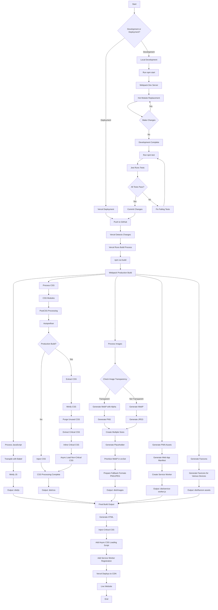

```mermaid
flowchart TD
    A[Start] --> B{Development or Deployment?}
    B -->|Development| C[Local Development]
    B -->|Deployment| D[Vercel Deployment]

    C --> E[Run npm start]
    E --> F[Webpack Dev Server]
    F --> G[Hot Module Replacement]
    G --> H{Make Changes}
    H -->|Yes| G
    H -->|No| I[Development Complete]

    D --> J[Push to GitHub]
    J --> K[Vercel Detects Changes]
    K --> L[Vercel Runs Build Process]

    L --> M[npm run build]
    M --> N[Webpack Production Build]

    N --> O[Process JavaScript]
    N --> P[Process CSS]
    N --> Q[Process Images]
    N --> R[Generate PWA Assets]
    N --> S[Generate Favicons]

    O --> O1[Transpile with Babel]
    O1 --> O2[Minify JS]

    P --> P1[CSS Modules]
    P1 --> P2[PostCSS Processing]
    P2 --> P3[Autoprefixer]
    P3 --> P4{Production Build?}
    P4 -->|Yes| P5[Extract CSS]
    P4 -->|No| P6[Inject CSS]
    P5 --> P7[Minify CSS]
    P7 --> P8[Purge Unused CSS]
    P8 --> P9[Extract Critical CSS]
    P9 --> P10[Inline Critical CSS]
    P10 --> P11[Async Load Non-Critical CSS]
    P6 --> P12[CSS Processing Complete]
    P11 --> P12

    Q --> Q1{Check Image Transparency}
    Q1 -->|Transparent| Q2[Generate WebP with Alpha]
    Q1 -->|Not Transparent| Q3[Generate WebP]
    Q2 --> Q4[Generate PNG]
    Q3 --> Q5[Generate JPEG]
    Q4 --> Q6[Create Multiple Sizes]
    Q5 --> Q6
    Q6 --> Q7[Generate Placeholder]
    Q7 --> Q8[Prioritize WebP in srcSet]
    Q8 --> Q9[Prepare Fallback Formats PNG/JPEG]

    R --> R1[Generate Web App Manifest]
    R1 --> R2[Create Service Worker]

    S --> S1[Generate Favicons for Various Devices]

    O2 --> T[Output: dist/js]
    P12 --> U[Output: dist/css]
    Q9 --> V[Output: dist/images]
    R2 --> W[Output: dist/service-worker.js]
    S1 --> X[Output: dist/favicon assets]

    T --> Y[Final Build Output]
    U --> Y
    V --> Y
    W --> Y
    X --> Y

    Y --> Z[Generate HTML]
    Z --> AA[Inject Critical CSS]
    AA --> AB[Add Async CSS Loading Script]
    AB --> AC[Add Service Worker Registration]

    AC --> AD[Vercel Deploys to CDN]
    AD --> AE[Live Website]

    I --> AF[Run npm test]
    AF --> AG[Jest Runs Tests]
    AG --> AH{All Tests Pass?}
    AH -->|Yes| AI[Commit Changes]
    AH -->|No| AJ[Fix Failing Tests]
    AJ --> AF

    AI --> J

    AE --> AK[End]

```
