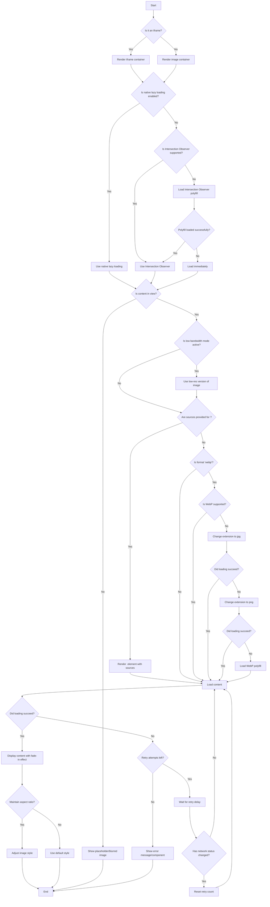

```mermaid
graph TD
    A[Start] --> B{Is it an iframe?}
    B -->|Yes| C[Render iframe container]
    B -->|No| D[Render image container]
    
    C --> E{Is native lazy loading enabled?}
    D --> E
    
    E -->|Yes| F[Use native lazy loading]
    E -->|No| G{Is Intersection Observer supported?}
    
    G -->|Yes| H[Use Intersection Observer]
    G -->|No| I[Load Intersection Observer polyfill]
    I --> J{Polyfill loaded successfully?}
    J -->|Yes| H
    J -->|No| K[Load immediately]
    
    F --> L{Is content in view?}
    H --> L
    K --> L
    
    L -->|No| M[Show placeholder/blurred image]
    L -->|Yes| N{Is low bandwidth mode active?}
    
    N -->|Yes| O[Use low-res version of image]
    N -->|No| P{Are sources provided for <picture>?}
    
    O --> P
    P -->|Yes| Q[Render <picture> element with sources]
    P -->|No| R{Is format 'webp'?}
    
    Q --> S[Load content]
    R -->|Yes| T{Is WebP supported?}
    R -->|No| S
    
    T -->|Yes| S
    T -->|No| U[Change extension to jpg]
    U --> V{Did loading succeed?}
    
    V -->|Yes| S
    V -->|No| W[Change extension to png]
    W --> X{Did loading succeed?}
    
    X -->|Yes| S
    X -->|No| Y[Load WebP polyfill]
    Y --> S
    
    S --> Z{Did loading succeed?}
    
    Z -->|Yes| AA[Display content with fade-in effect]
    Z -->|No| AB{Retry attempts left?}
    
    AB -->|Yes| AC[Wait for retry delay]
    AB -->|No| AD[Show error message/component]
    
    AC --> AE{Has network status changed?}
    AE -->|Yes| AF[Reset retry count]
    AE -->|No| S
    
    AF --> S
    
    AA --> AG{Maintain aspect ratio?}
    AG -->|Yes| AH[Adjust image style]
    AG -->|No| AI[Use default style]
    
    AH --> AJ[End]
    AI --> AJ
    M --> AJ
    AD --> AJ

```
