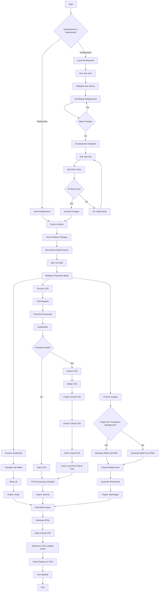

```mermaid
flowchart TD
    A[Start] --> B{Development or Deployment?}
    B -->|Development| C[Local Development]
    B -->|Deployment| D[Vercel Deployment]

    C --> E[Run npm start]
    E --> F[Webpack Dev Server]
    F --> G[Hot Module Replacement]
    G --> H{Make Changes}
    H -->|Yes| G
    H -->|No| I[Development Complete]

    D --> J[Push to GitHub]
    J --> K[Vercel Detects Changes]
    K --> L[Vercel Runs Build Process]

    L --> M[npm run build]
    M --> N[Webpack Production Build]

    N --> O[Process JavaScript]
    N --> P[Process CSS]
    N --> Q[Process Images]

    O --> O1[Transpile with Babel]
    O1 --> O2[Minify JS]

    P --> P1[CSS Modules]
    P1 --> P2[PostCSS Processing]
    P2 --> P3[Autoprefixer]
    P3 --> P4{Production Build?}
    P4 -->|Yes| P5[Extract CSS]
    P4 -->|No| P6[Inject CSS]
    P5 --> P7[Minify CSS]
    P7 --> P8[Purge Unused CSS]
    P8 --> P9[Extract Critical CSS]
    P9 --> P10[Inline Critical CSS]
    P10 --> P11[Async Load Non-Critical CSS]
    P6 --> P12[CSS Processing Complete]
    P11 --> P12

    Q --> Q1{Image has Transparent Background?}
    Q1 -->|Yes| Q2[Generate WebP and PNG]
    Q1 -->|No| Q3[Generate WebP and JPEG]
    Q2 --> Q4[Create Multiple Sizes]
    Q3 --> Q4
    Q4 --> Q5[Generate Placeholder]

    O2 --> R[Output: dist/js]
    P12 --> S[Output: dist/css]
    Q5 --> T[Output: dist/images]

    R --> U[Final Build Output]
    S --> U
    T --> U

    U --> V[Generate HTML]
    V --> W[Inject Critical CSS]
    W --> X[Add Async CSS Loading Script]

    X --> Y[Vercel Deploys to CDN]
    Y --> Z[Live Website]

    I --> AA[Run npm test]
    AA --> AB[Jest Runs Tests]
    AB --> AC{All Tests Pass?}
    AC -->|Yes| AD[Commit Changes]
    AC -->|No| AE[Fix Failing Tests]
    AE --> AA

    AD --> J

    Z --> AF[End]

```
